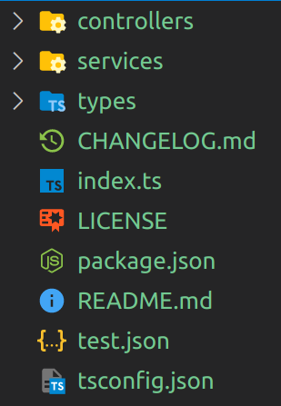

# express-app-generator

The express-app-generator generates projects files from an OpenAPI document to get you started with an Express TypeScript app. It generates a controller with the defined endpoints, a service to pass the requests on to and TypeScript types.

## Requirements

In order to use the express-app-generator you need an installation of Node.js. The express-app-generator was developed with Node.js version v14.16.1.

## Features

* Creates basic project structure
* Creates a controller class with the endpoints defined in an OpenAPI document
* Creates a service class with the methods derived from an OpenAPI document
* Creates TypeScript types derived from an OpenAPI document
* Creates a Postman project file containing requests for the endpoints defined in an OpenAPI document



## Installation

???

```
npm i -g https://github.com/hendrik-scholz/express-app-generator/#master
```

## Usage
## Test

Run the following command from the directory where the package.json is located.

```
npm test
```
